# Dynamic Identity Geneva Pride - ABSTRACT

The following project is a study of the dynamic identity of the Geneva Pride. Through the colors and the different geometric shapes the constructed pattern recalls the colors of the Pride flag and underlines the aspects of its themes. Like gender, the pattern always shows itself different in shapes and colors, its fluid and energetic dynamism represents every kind of diversity and builds an inclusive and never rhetorical communication.
## Shapes

The tool used to create the pattern is Processing, a console for writing code in the context of the visual arts. The shapes are the square, triangle and circle. They are all arranged on a grid through the very modulation of the geometric elements following this code syntax:

```
for( int x = 0; x < width; x += d) {
    for (int y = 0; y < height; y+= d) {
      if (int(num) % 7 == 0) {
        triangle(x, y, x+d, y, x, y + d);
      } 
      else if (int(num) % 12 == 0){
        ellipse(x+d2, y+d2, d,d);
      }
       else if (int(num) % 8 == 0){
        triangle(x+d, y+d, x+d, y, x, y+d);
      }
        else if (int(num) % 6 == 0){
        triangle(x, y, x+d, y+d, x, y+d);
      }
        else if (int(num) % 5 == 0){
        triangle(x, y, x+d, y, x+d, y+d);
      }
      else {
        rect(x, y, d,d);
      }
    }
  }
```

<p float="left">
  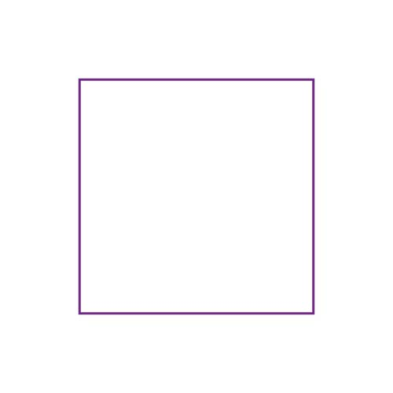
  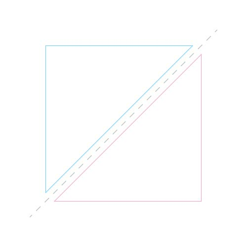 
  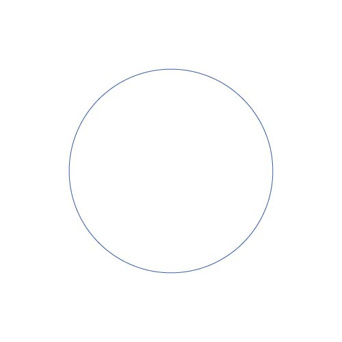
  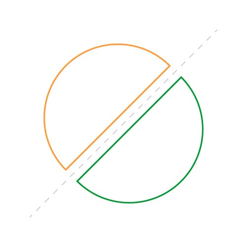
</p>


## Colors

The hex color codes are collected in variants of their name and gathered into an array.

```
color noir = #000000;
color blanc = #ffffff;
color marron = #663300;
color orange = #ff9933;
color vert = #009933;
color rose = #ff99cc;
color jaune = #ffff33; 
color violet = #732886; 
color azure = #66ccff; 
color rouge = #e61f27; 
color bleu = #3c61ab; 

color [] colors = {noir, blanc, marron, orange, vert, rose, jaune, violet, azure, rouge, bleu};
```

## Showcases

### Pattern
<!-- Pattern -->
<p align="center">
  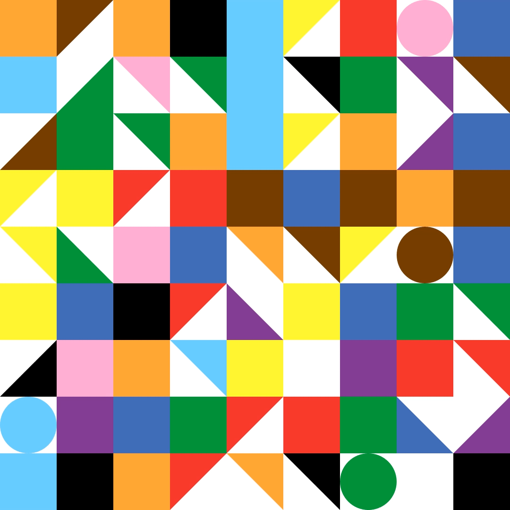
</p>

### Video TPG

<p align="center">

</p>

<p align="center">
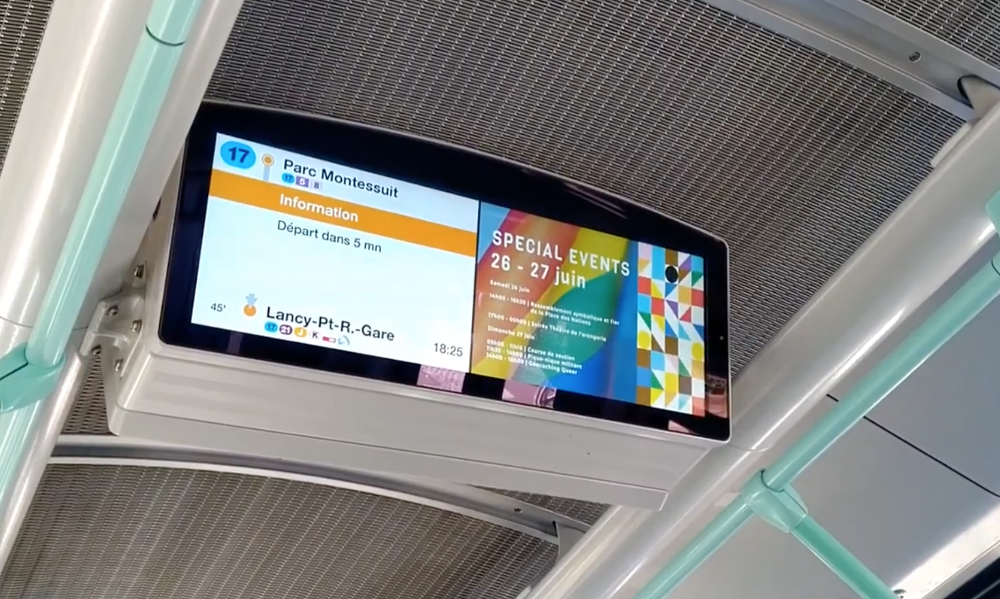
</p>

### Project for Épicène

<p float="left">
  
  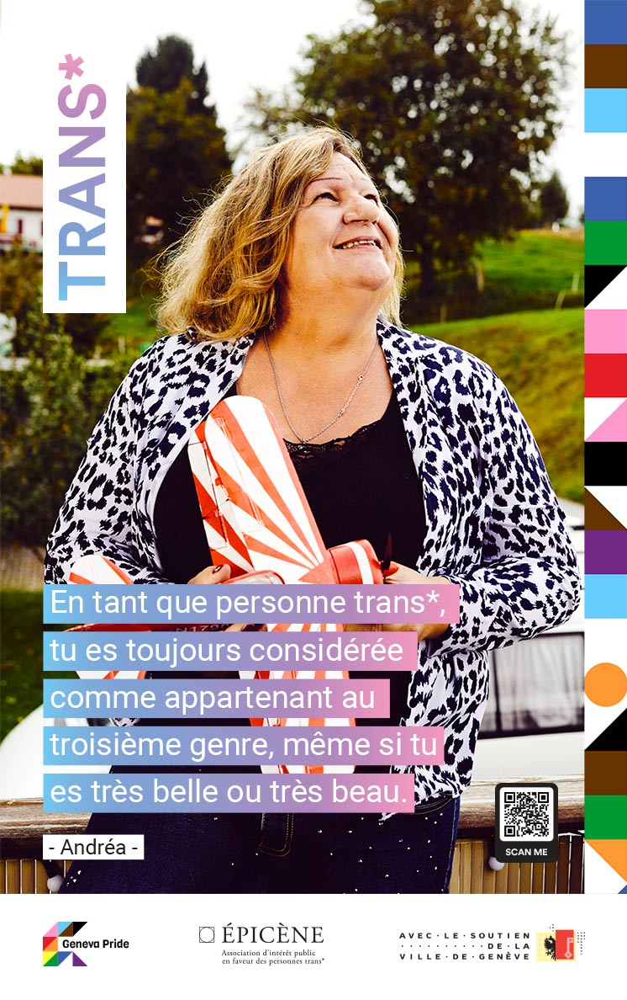
  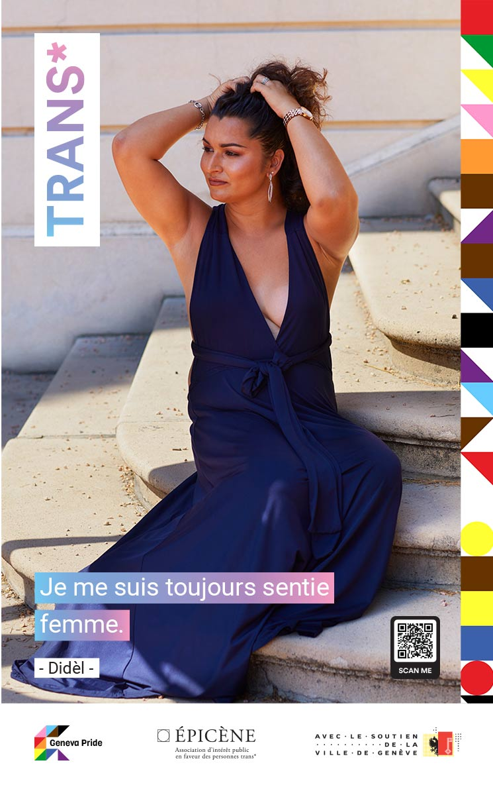
  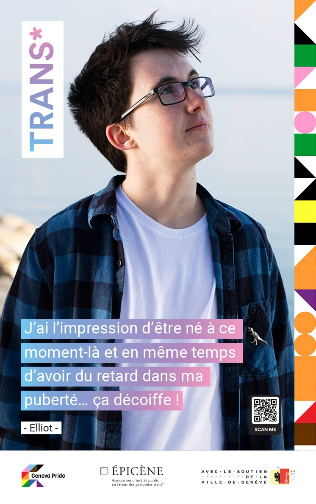
</p>
<p float="left">
  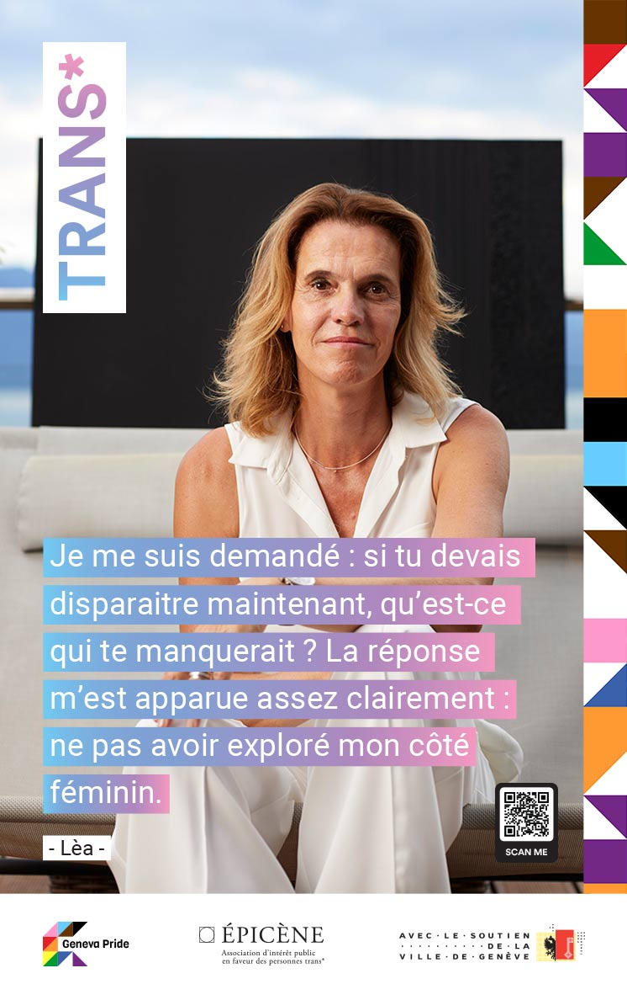
  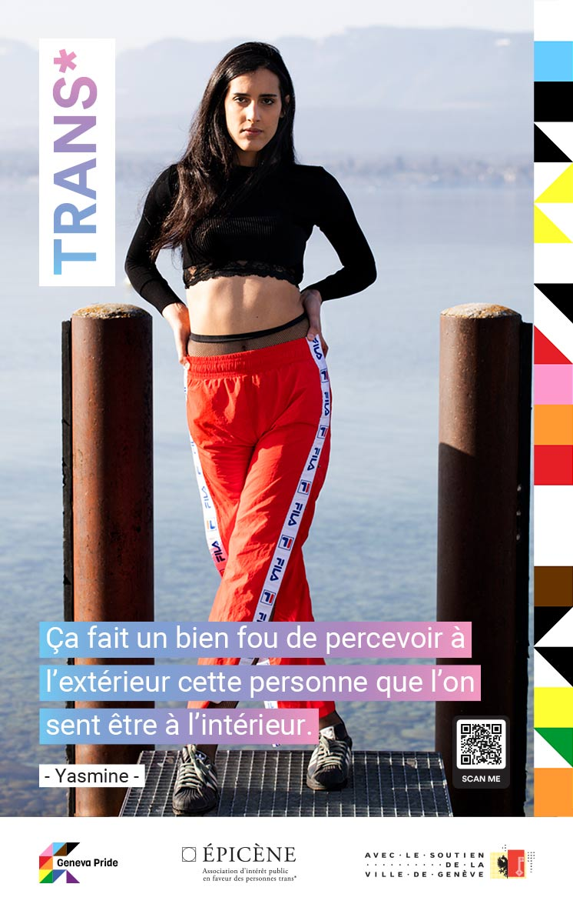
  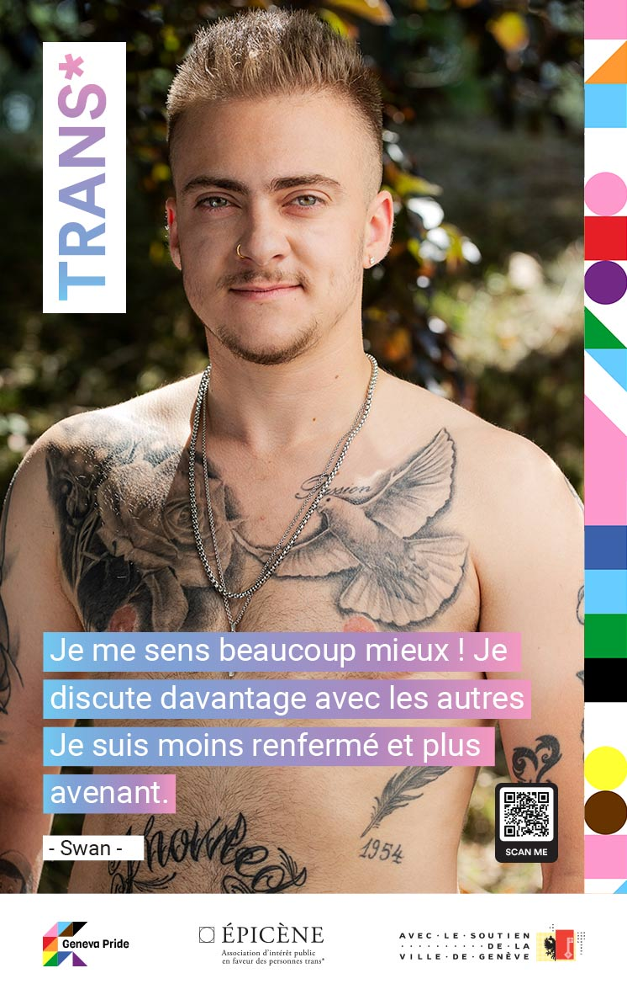
  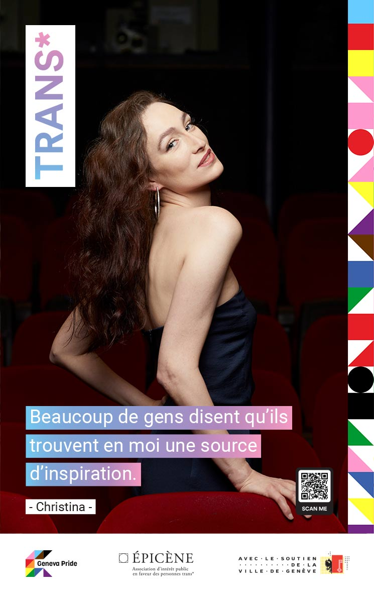
</p>


## Authors

[Matteo Di Rollo](https://github.com/matteo-dirollo)

## License
MIT License

Copyright (c) 2012-2022 Scott Chacon and others

Permission is hereby granted, free of charge, to any person obtaining
a copy of this software and associated documentation files (the
"Software"), to deal in the Software without restriction, including
without limitation the rights to use, copy, modify, merge, publish,
distribute, sublicense, and/or sell copies of the Software, and to
permit persons to whom the Software is furnished to do so, subject to
the following conditions:

The above copyright notice and this permission notice shall be
included in all copies or substantial portions of the Software.

THE SOFTWARE IS PROVIDED "AS IS", WITHOUT WARRANTY OF ANY KIND,
EXPRESS OR IMPLIED, INCLUDING BUT NOT LIMITED TO THE WARRANTIES OF
MERCHANTABILITY, FITNESS FOR A PARTICULAR PURPOSE AND
NONINFRINGEMENT. IN NO EVENT SHALL THE AUTHORS OR COPYRIGHT HOLDERS BE
LIABLE FOR ANY CLAIM, DAMAGES OR OTHER LIABILITY, WHETHER IN AN ACTION
OF CONTRACT, TORT OR OTHERWISE, ARISING FROM, OUT OF OR IN CONNECTION
WITH THE SOFTWARE OR THE USE OR OTHER DEALINGS IN THE SOFTWARE.