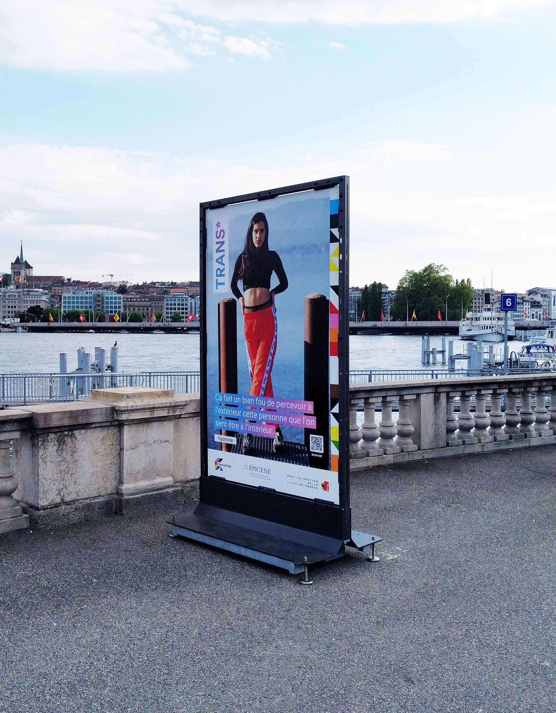

# Dynamic Identity Geneva Pride - ABSTRACT

The following project is a study of the dynamic identity of the Geneva Pride. Through the colors and the different geometric shapes the constructed pattern recalls the colors of the Pride flag and underlines the aspects of its themes. Like gender, the pattern always shows itself different in shapes and colors, its fluid and energetic dynamism represents every kind of diversity and builds an inclusive and never rhetorical communication.
## Shapes

The tool used to create the pattern is Processing, a console for writing code in the context of the visual arts. The shapes are the square, triangle and circle. They are all arranged on a grid through the very modulation of the geometric elements following this code syntax:

```
for( int x = 0; x < width; x += d) {
    for (int y = 0; y < height; y+= d) {
      if (int(num) % 7 == 0) {
        triangle(x, y, x+d, y, x, y + d);
      } 
      else if (int(num) % 12 == 0){
        ellipse(x+d2, y+d2, d,d);
      }
       else if (int(num) % 8 == 0){
        triangle(x+d, y+d, x+d, y, x, y+d);
      }
        else if (int(num) % 6 == 0){
        triangle(x, y, x+d, y+d, x, y+d);
      }
        else if (int(num) % 5 == 0){
        triangle(x, y, x+d, y, x+d, y+d);
      }
      else {
        rect(x, y, d,d);
      }
    }
  }
```

<p float="left">
  
   
  
  
</p>


## Colors

The hex color codes are collected in variants of their name and gathered into an array.

```
color noir = #000000;
color blanc = #ffffff;
color marron = #663300;
color orange = #ff9933;
color vert = #009933;
color rose = #ff99cc;
color jaune = #ffff33; 
color violet = #732886; 
color azure = #66ccff; 
color rouge = #e61f27; 
color bleu = #3c61ab; 

color [] colors = {noir, blanc, marron, orange, vert, rose, jaune, violet, azure, rouge, bleu};
```

## Showcases

### Pattern
<!-- Pattern -->
<p align="center">
  
</p>
<!-- Épicène -->
<p float="left">
  
</p>

[](https://youtu.be/C7cZxNpPmFY)

## Authors

## License


