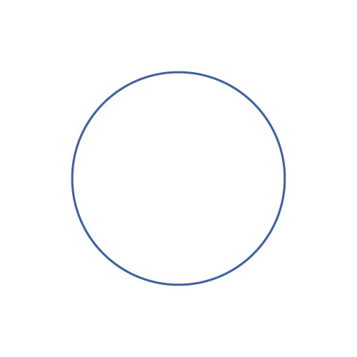

# Dynamic Identity Geneva Pride - ABSTRACT

The following project is a study of the dynamic identity of the Geneva Pride. Through the colors and the different geometric shapes the constructed pattern recalls the colors of the Pride flag and underlines the aspects of its themes. Like gender, the pattern always shows itself different in shapes and colors, its fluid and energetic dynamism represents every kind of diversity and builds an inclusive and never rhetorical communication.
## Shapes

<!-- 

  
   
  
  

 -->

## Colors

## Code

## Usage Examples

## Authors

## License

